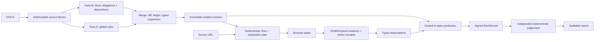

# Survey QA

Survey QA compares a Word questionnaire with the survey respondents actually receive. Give the
v2 service a `.docx` and a survey URL; it extracts a fixed testing contract, drives the site in a
real browser, preserves the evidence, derives results without letting a model certify itself, and
builds an auditable report.

The binding acceptance rule is broader than any one questionnaire or vendor:

> **The architecture must work for any survey + link combination.**

Example surveys are measurement instruments, not specifications. A convention such as a question
id in HTML, one question per page, forward-only navigation, grey-highlighted instructions, or a
particular survey platform may be used only when it is declared, checked, and converted into a
named limitation when it does not hold. The questionnaire is the source of truth; ambiguity in it
is surfaced, never guessed.

## Start here

- [System overview](docs/SYSTEM-OVERVIEW.md) explains the complete lifecycle and the terms used in
  code: blocks, windows, chunks, waves, obligations, dispositions, cases, paths, observations,
  verification, judgements, coverage, and completion.
- [AGENTS.md](AGENTS.md) contains the binding North Star, fail-loud rules, and blind-evaluation
  boundary for contributors and coding agents.
- [Document-processing playbook](docs/document-processing-playbook.md) records the evidence behind
  ingestion and graph-coverage decisions. Some implementation-status sentences in that historical
  design record predate the current Worker; use source and fresh tests for present-tense claims.
- [v2 migration boundary](worker-v2/MIGRATION.md) explains why v2 cannot read or write v1 state.
- [v2 deployment guide](worker-v2/DEPLOY.md), [deployed-service record](worker-v2/DEPLOYED.md), and
  [canary integrity contract](docs/CANARY-DEPLOYMENT-INTEGRITY-11AUG.md) are the operational records.
  They are dated records: verify current Cloudflare state before acting on a version id or count.

## Current posture — 13 August 2026

| Surface | Honest status |
|---|---|
| v2 service | Deployed at `https://survey-qa-v2.wellshit.co.in`, behind its own Cloudflare Access application. Per-run status is authoritative; a deployed route is not proof that a particular run completed. |
| Core workflow | Implemented as durable Cloudflare Workflow stages: parse/extract, seal, plan, Browser Rendering execution, observation projection, deterministic tri-state verification, deterministic aggregation, signed record, independent judgement, and report. |
| Document extraction | The intended normal route is exact `grok-4.5` for the whole-document pass and DeepSeek Pro for the independent block pass. An eligible, retained typed Grok failure alone may substitute DeepSeek Flash for Pass A; Flash+Pro is reduced same-provider independence and cannot seal as normal corroboration. Paid Grok calls require the exact 16-field owner-console-confirmation rate binding described below. Units are persisted and resumed rather than silently truncated or repeatedly purchased. |
| Browser evidence | Real screen JSON, viewport screenshots, Chrome accessibility snapshots, action receipts, and before/action/after state are captured. Missing modalities and controls the walker cannot answer are counted. |
| Deterministic verifier | Route, boundary-validation, and option-membership predicates are registered. Unrecognised or incompletely evidenced cases become `insufficient`, never a guessed pass. |
| Visual perception | Capture/reconciliation infrastructure exists, but paid visual inference is shadow-only and disabled in deployable configuration. The prior Gemma/Gemini/Mistral comparison did not establish a production winner. |
| OpenAI computer use | The Luna/Terra adapter is a local/mock **GO (21/21)** but a production **NO-GO** because it remains unintegrated: it is not wired into `walkPath`, verification, or production evidence. It has no implicit credential, page origin, budget, pricing, or network client, and it will send a supplied credential only to the exact official Responses endpoint. |
| Known execution limits | One fixed desktop viewport; native single-select only; named custom-widget, native multi-select, and drag-and-drop limits; no back-navigation receipt; no independent-session repeat execution. Each becomes a named limitation rather than fake coverage. |
| v1 | Historical production system. **Do not deploy, edit, probe, or reuse its URL/subsystems during v2 work.** v2 has a different Worker, host, Access app, Workflow, run-id shape, binding name, and R2 prefix. |

The reviewed Grok prerequisite is the exact 16-field
`survey-qa-grok-rate-binding/1.0.0` binding for `grok-4.5`: source
`owner-console-confirmation`, policy `max-known-text-tier/1.0.0`, observed 15 August 2026,
canonical SHA-256 `9bc864b4e87925b6bc7d4426e3a074d6f5b7e5c8b582e1e91e0b257a2618289e`,
500K context, and a 200K long-context threshold. Input/cached-input/output rates are
$2/$0.30/$6 per Mtok at or below 200K and $4/$0.60/$12 above 200K; the max-known
reservation is $4/$12 per Mtok. A future authenticated exact-model catalogue receipt is an
independent cross-check only, not the provenance of this binding or a release prerequisite.

The worktree can be ahead of the deployed Worker. “Implemented locally”, “tested”, “uploaded as a
version”, and “receiving production traffic” are different claims. Do not infer one from another.

## Lifecycle in one view



Two principles keep the diagram honest:

1. The sealed contract fixes the denominator before the browser runs. Exploration may add findings;
   it cannot shrink or enlarge the mandatory case set.
2. Models may propose document structure or inventory pixels. They do not author `pass` or `fail`.
   Current results require deterministic derivation from re-read evidence and a valid binding.

See [docs/SYSTEM-OVERVIEW.md](docs/SYSTEM-OVERVIEW.md) for what every box means and which parts are
currently limited.

## Repository map

| Path | Role |
|---|---|
| `worker-v2/` | Deployed v2 Worker, API, Workflow, parser, extractor, planner adapter, browser driver, verifier, record/report paths, and v2 test harness |
| `pipeline/` | Shared/offline deterministic planner, judge, and report implementation plus public synthetic run material |
| `scorer/` | Fail-closed schemas, oracle/scoring code, integrity checks, fixtures, and mutation harness |
| `evaluation/` | Pre-registered arm/ablation harness; read `evaluation/PRE-REGISTRATION.md` before changing it |
| `graph-spike/` | Empirical graph/crawler prototype and the generalizability failures in `FINDINGS.md` |
| `docs/` | Design records, reviews, operational handoffs, and evidence-backed playbooks |
| `src/`, `runner/`, root `wrangler.jsonc` | v1 implementation and configuration; historical/operationally separate from v2 |
| `test-suite/blind/` | Blind evaluation material. Do not inspect it or its keys while developing the system |

## Local verification

Install the root dependencies. The v2 package intentionally resolves its tools
from the repository root.

```bash
npm install
cd worker-v2
npm run typecheck
node tools/test.mjs
```

The suite contains negative fixtures and mutation checks because a green gate that cannot fail is
not evidence. Do not quote an old test count as current; report the command, exit code, and fresh
denominator from the run you actually performed.

For local UI/runtime inspection, follow [worker-v2/PREVIEW.md](worker-v2/PREVIEW.md). For deployment,
rollback, live Workflow inspection, and the hardened canary path, use the checked-in operational
documents linked above rather than reconstructing commands from memory. Deployments are serial:
freeze and verify one source/config/document tuple, let both relevant Workflows become terminal,
retain the evidence, then consider another version.

## Evaluation and safety boundaries

- Never read `test-suite/blind/**`, hidden truth material, or `sprint/04-CORPUS.md` while authoring
  the system. See [docs/EVALUATION-BOUNDARY.md](docs/EVALUATION-BOUNDARY.md).
- Never turn unread input, a failed call, an empty denominator, or missing evidence into “zero
  problems”. Those are named unavailable/failed/unresolved states.
- Never mix the document-requirement denominator with the execution-case denominator. Coverage
  buckets reconcile to cases; report rows reconcile to document requirements.
- Never let v2 touch v1 keys or routes. Every v2 R2 key is minted under `v2/`, and v2 run ids begin
  `v2r_`.
- Never call a report “final” merely because rendering finished. Test completion, report completion,
  verdicts, integrity, and judgement authority are separate axes.
