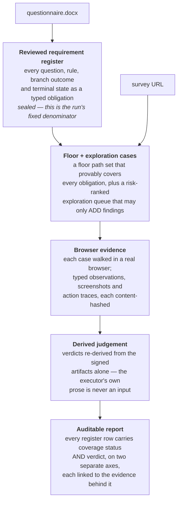

# Survey QA

**Catch survey-programming errors before they corrupt your data.**

A market-research survey is programmed from a Word questionnaire by hand. The questionnaire
says option 5 is "Stovetop moka pot", that answering "Can't remember" at Q7 must skip Q8, that
the allocation grid must sum to 100. The live survey is supposed to do all of that. When it
does not, nobody finds out from the survey — they find out weeks later, from data that cannot
be analysed, after real respondents have already answered.

Checking this by hand means one person clicking every path through a survey with a document
open beside them. It is slow, it is boring, and it is exactly the kind of work where a human
misses the third branch of the seventh question.

This project automates that check: **hand it a survey link and its questionnaire, get back a
report that says what was checked, what disagrees with the document, and what evidence proves
it.**

---

## Status — 2 August 2026

> The words below are used precisely and are not interchangeable. *deployed* = reachable ·
> *implemented* = code exists · *locally verified* = named tests passed · *fixture-rendered* =
> worked on constructed data only · *offline-demonstrated* = a real run worked outside the
> Worker · *stubbed* = intentionally returns no substantive result · *end-to-end* = a
> submission reaches a truthful report through the supported runtime with no manual handoff.

| | |
|---|---|
| **Deployed** | The **v1** proof of concept, at a custom domain behind Cloudflare Access. Login required; the old `*.workers.dev` URLs are dead. Last observed answering behind the login on **1 Aug 2026**. It is deployed — and it is no longer the direction |
| **Implemented and locally verified** | The **v2** control plane: requirement register, scorer, evidence integrity, derived-verdict judge, report renderer, storage and Worker shell. Test results and dates in [docs/STATE-OF-PLAY.md](docs/STATE-OF-PLAY.md) §6 |
| **In progress right now** | Extraction, planning, browser execution and judging are being wired into the v2 Worker as you read this. Until that lands, a real submission to v2 stores the document, never opens it, and ends honestly with no contract at all — see [docs/STATE-OF-PLAY.md](docs/STATE-OF-PLAY.md) §4 |
| **Offline-demonstrated** | One real browser run against one blind survey on **1 Aug 2026** — real Chromium, 119 requirements, 103 evidence artifacts, 95 attempts — driven by scripts **outside** the Worker. It proves parts of the architecture. It does not prove a working v2 service, and it does not prove vendor independence |
| **Not yet** | v2 is not deployed. No route, no Access application, no v2 hostname. No v2 code has ever written to the production R2 bucket |
| **Retired** | The single-path deterministic walker, and the three-model N-of-3 consensus design. Both were the v1 product; both were retired as the direction on 1 Aug 2026. See [v1 history](#v1-history) |

**One phrase to use carefully.** The v1 system is deployed and the v2 stages that would make
it LLM-led are being wired now — so do not call the current product "LLM-led" unqualified.
The accurate framing is: **the v2 target uses LLM-led extraction and navigation on a
deterministic, evidence-attested control plane.**

**[docs/STATE-OF-PLAY.md](docs/STATE-OF-PLAY.md) is the single source of truth for status and
counts.** It is the only file that carries live numbers; everything else links to it.

---

## The v2 target flow

The design principle: **an LLM decides, but it never certifies itself.** Every decision it
makes lands on a fixed, machine-checkable substrate — a sealed list of obligations, constrained
browser tooling, hard budgets, and evidence captured at every step. A free-roaming browsing
agent cannot prove what it covered; a hand-maintained rules engine is what this project agreed
to leave behind.



Two things are scored separately and must never be added together: **execution coverage** (did
we exercise the register?) and **extraction accuracy** (did the register faithfully capture the
document?). Without the second, an incomplete register reports a confident, meaningless 100%.

Why "derived judgement" is its own stage: on the one real run, the step that wrote verdicts in
prose recorded three obligations as PASS while citing the artifact that proved the opposite.
Re-deriving those verdicts from the artifacts alone removed all three. That failure, and its
fix, are the reason the architecture looks like this.

Full design: [docs/llm-led-architecture-proposal.md](docs/llm-led-architecture-proposal.md) ·
[docs/structured-claim-contract-merged.md](docs/structured-claim-contract-merged.md).

---

## Capability matrix

| Capability | Status |
|---|---|
| v1 walker + consensus report | **deployed**, retired as direction |
| Cloudflare Access in front of v1 | **deployed**, last observed 1 Aug 2026 |
| v2 Worker shell — routing, submission, durable checkpoints, status/coverage projections, cron sweeper | **implemented, locally verified** |
| Evidence storage + integrity — content-addressed, write-once catalogue, re-hashed on every read, fail-closed | **implemented, locally verified** |
| Judgement trust boundary — Ed25519 attestation against a pinned registry, run-binding recomputed from durable state | **implemented, locally verified** |
| Requirement register + report renderer | **implemented, locally verified**; every register rendered so far is **fixture-rendered** |
| Derived-verdict judge | **implemented, locally verified**, independently audited three times |
| Scorer — fail-closed validation, attestation, defect matching, metrics | **implemented, locally verified** |
| Two-tier coverage planner (floor + directed exploration) | **implemented** offline; not wired into the Worker |
| Blind + branching corpora with machine-readable ground truth | **implemented** |
| Document extraction in the Worker | **stubbed — being built now** |
| Planning / case generation in the Worker | **stubbed — being built now** |
| Browser execution in the Worker | **stubbed — being built now** |
| Verification + verdict derivation in the Worker | **stubbed — being built now** |
| Cost and usage accounting | **not implemented** — the caps are enforced against counters nothing increments |
| Model calls inside the v2 Worker | **none exist today** |
| A submission reaching a truthful report through the v2 runtime | **not yet end-to-end** |

Per-file evidence for every row: [docs/STATE-OF-PLAY.md](docs/STATE-OF-PLAY.md) §4.

---

## Evidence so far

**One real browser run, 1 August 2026** — against `test-suite/blind/t1-easy`, a blind-corpus
survey whose answer key was attested unread during extraction, planning and execution. Real
headless Chromium (Puppeteer 25.4.0, `Chrome/151.0.7922.47`) against a local static server,
driven from local Node — **no Cloudflare Worker was involved**.

- **119** requirements (the sealed denominator) · **103** evidence artifacts, all byte-hashed
  into the signed record · **95** attempts across **89** distinct paths, in **84** browser
  sessions · two viewports.
- **7 model calls in total, all extraction** (`@cf/openai/gpt-oss-120b`). **Zero during
  navigation and judging** — navigation ran deterministically from the plan, and every verdict
  was a deterministic DOM assertion. The $0.00 execution spend is not a cost result; it is the
  absence of the expensive component.
- Scored against the hidden key: **2 of 3 seeded defects reported**, **3 false passes**, **1
  penalized false positive**, and 6 of the key's 7 expected-false-positive traps correctly
  avoided.
- Plus one finding the expert answer key itself does not contain: in an unmodified browser the
  survey **does not render at all**. That came from driving a real browser rather than a DOM
  emulation — which is also why every other verdict in the run is conditional on a disclosed
  one-line page shim, without which nothing renders.
- The run's own debrief is blunt about its limits: *"Treat the current pass rate as unmeasured,
  not as 94%."* One survey, one tier, the easiest tier, n=1. No loops, quotas, piping or
  carry-forward lists were exercised. The driver script lived in a scratch directory and is not
  in this repo, so the run is **attested, not reproducible from a clean clone**.

Read it in full — including the parts that did not work — in
[pipeline/runs/t1-easy/DEBRIEF.md](pipeline/runs/t1-easy/DEBRIEF.md).

**What the derived judge did to that run.** Re-deriving every verdict from the signed artifacts
alone removed all three false passes and turned the missed seeded defect into a catch cited to
the artifact that proves it: **seeded recall 2/3 → 3/3, penalized false positives 1 → 0**, at
the cost of a smaller decided set (103 → 90 rows). An independent auditor re-resolved all 673
emitted witnesses with a from-scratch resolver and found zero mismatches —
[pipeline/judge/VERIFICATION.md](pipeline/judge/VERIFICATION.md).

**What has crossed into the Worker.** An offline-assembled signed record plus an attested
judgement does reach the v2 Worker and publish as current results, proven on the published HTTP
bytes. It required hand-bridging one field the Worker's only write path cannot carry, so it is
not yet end-to-end — [pipeline/judge/VERIFICATION-ROUND3.md](pipeline/judge/VERIFICATION-ROUND3.md).

**Test suites.** Measured results with commands, dates and denominators live in
[docs/STATE-OF-PLAY.md](docs/STATE-OF-PLAY.md) §6, including the two suites that were red at
the time of writing because the tree was mid-edit.

---

## Repository map

| Path | What it is |
|---|---|
| `src/`, `public/`, `spec/`, `scripts/`, `runner/` | The **v1** system — walker, docx parser, model legs, consensus report, the seeded demo survey and its generators. Deployed |
| `worker-v2/` | The **v2** Worker — shell, storage, evidence integrity, judgement trust boundary, report bridge. Control plane implemented, pipeline stages stubbed. Not deployed |
| `pipeline/` | The offline v2 pipeline — `planner/` (two-tier coverage planner), `judge/` (derived-verdict engine), `report/` (audit report renderer, shared verbatim with the Worker), `runs/t1-easy/` (the one real run) |
| `scorer/` | Fail-closed scoring of a run against a hidden oracle, with its threat model and mutation harness |
| `test-suite/` | `blind/` (four tiers of blind corpus; ground truth is gitignored), `branching/` (six routing / logic / calculation packages), `cases/` + `testbench/` (the v1 held-out multilingual suite) |
| `docs/` | Design records, decisions and status — [indexed here](docs/README.md) |

---

## Local development

Requires **Node 22+**. Deploying requires a Cloudflare account on the Workers Paid plan
(Browser Rendering + Workflows).

```bash
npm install

# v1 — the deployed system
npm run typecheck
npx wrangler dev

# v2 — where the work is
cd worker-v2
npm run typecheck
node tools/test.mjs                                    # no server needed
npx wrangler dev --port 8799 --var DEV_SEED:enabled
node tools/smoke.mjs                                   # second shell, against that server

# offline pipeline + scorer
node scorer/test/run-suites.mjs
node --test pipeline/judge/selftest/engine.test.mjs
```

`worker-v2` has **no `deploy` script**, deliberately: deploying is an owner action, sequenced
in [worker-v2/DEPLOY.md](worker-v2/DEPLOY.md) — Access application first, route second.

**A fresh clone will not deploy the v1 Worker as-is.** `wrangler.jsonc` carries the original
author's Cloudflare account identifiers. They are identifiers, not secrets, but you must point
them at your own account: `store_id` (×3, in `secrets_store_secrets`), `CF_AIG_ACCOUNT_ID`, and
`CF_AIG_GATEWAY_ID` (or delete both `CF_AIG_*` vars to call providers directly). API keys live
in the account-level Secrets Store, never in the repo, and each is seeded with `PLACEHOLDER` so
a model leg stays inert until its real key is set.

---

## v1 history

The v1 proof of concept is the system this README used to describe, and it is still the thing
that is deployed. **Its architecture was retired as the project's direction on 1 August 2026.**
This section is a record, not a plan.

**What it was.** A single Cloudflare Worker walked a live survey with a real browser, one page
at a time along a single path, and compared each rendered page against the Word questionnaire
using three independent model legs (DeepSeek, Grok, Claude) routed through an AI Gateway. A
finding was shown once, with N/3 model agreement, a confidence score, and verbatim quotes
verified against both the document and the rendered page.

**What it measured.** 10/10 recall on the seeded demo across six languages, and 239/240 seeded
errors across 24 held-out surveys the tool had never seen, at ~0.9 false positives per survey —
a blind dry-run on **5 July 2026**. Those numbers are real, and they describe the retired
system. Full record: [docs/RESULTS.md](docs/RESULTS.md) ·
[docs/model-bakeoff.md](docs/model-bakeoff.md) · [docs/hardening.md](docs/hardening.md) ·
[test-suite/README.md](test-suite/README.md).

**Why it was retired.** A single-path walker checks language and content fidelity well, but it
cannot testify about routing, branch outcomes, calculations or terminal states — it only ever
sees one path, and it cannot prove what it did not cover. And routine three-model consensus
spends triple at the execution layer, which is where cost is dominated. N-of-3 was not
abandoned; it moved to the judgment layer, where it is cheap and where the one real run showed
the failures actually live.

**How it is deployed.** Behind **Cloudflare Access** on a Workers custom domain, since 1 August
2026: one-time PIN or Google login, 24-hour sessions, an owners policy on a single email plus a
service-token policy for automation. The `*.workers.dev` route and the preview URLs were
disabled through the Cloudflare API and observed returning HTTP 404. Setup, verification and the
follow-ups that are **not** yet applied: [docs/access-setup.md](docs/access-setup.md).

**Two things to know before touching it.** The Worker contains no authentication in code — the
Access application at the edge is the entire control. And the root `wrangler.jsonc` declares
neither `workers_dev: false` nor `routes`, so a `wrangler deploy` from the repo root can
silently re-enable the public `workers.dev` route. Both are tracked in
[docs/STATE-OF-PLAY.md](docs/STATE-OF-PLAY.md) §3.

---

## Documentation

**[docs/README.md](docs/README.md)** indexes every document with a one-line description and a
label saying whether it is current normative, current implementation, a historical snapshot, or
owner-rejected.

Start with:

- **[docs/STATE-OF-PLAY.md](docs/STATE-OF-PLAY.md)** — what is true today, with dates. Read this first
- [docs/llm-led-architecture-proposal.md](docs/llm-led-architecture-proposal.md) — the v2 target architecture
- [docs/structured-claim-contract-merged.md](docs/structured-claim-contract-merged.md) — how a finding becomes a typed, evidence-bound fact
- [docs/ui-report-redesign.md](docs/ui-report-redesign.md) — the findings-first report the register feeds
- [docs/access-setup.md](docs/access-setup.md) — how the deployed Worker is locked down
