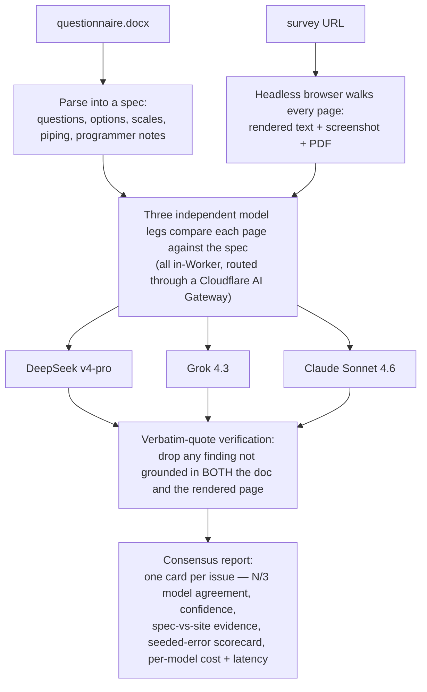

<h1 align="center">🔍 Survey QA</h1>

<p align="center"><b>Catch survey-programming errors before they corrupt your data.</b></p>

<p align="center">
A single Cloudflare Worker walks a live survey with a real browser, compares every page against its Word
questionnaire using <b>three independent LLMs</b>, and returns an issue-first consensus report — each
discrepancy shown once, with model agreement (N/3), a confidence score, and the verbatim evidence.
</p>

<p align="center">


</p>

<p align="center">
<a href="docs/RESULTS.md"><b>📊 Results</b></a> &nbsp;·&nbsp;
<a href="test-suite/README.md"><b>🌍 Unseen-data testbench</b></a> &nbsp;·&nbsp;
<a href="docs/model-bakeoff.md"><b>🏆 Model bakeoff</b></a> &nbsp;·&nbsp;
<a href="docs/hardening.md"><b>🛡️ Hardening</b></a>
</p>

---

> **Iteration 1** covers **language / content fidelity** — typos, missing / renamed options, broken piping,
> scale mislabels, reordered options, wrong numbering, encoding artifacts, missing instructions. Later
> iterations extend the same walker to routing / logic, calculations, and validation (see the roadmap below).

## ⚙️ How it works



## 📊 Validation at a glance

- **Benchmark:** 10/10 recall on the seeded demo — every run, all six languages.
- **Held-out generalization:** **239 / 240** seeded errors caught across **24 unseen surveys** (4 diseases × 6 languages) the tool had never encountered — at ~0.9 false positives per survey.

Full detail: [Validation & Results](docs/RESULTS.md) · [held-out testbench + scoreboard](test-suite/README.md) · [model bakeoff](docs/model-bakeoff.md) · [correctness & security hardening](docs/hardening.md).

**Why three models, and these three?** In a multi-model design, a *missed* error (false negative) is the
expensive failure — it ships to respondents and corrupts data — while a false positive is cheap (a few
seconds of review, and consensus demotes lone flags to low confidence). So the roster optimizes
**ensemble recall**: three independent families (DeepSeek / xAI / Anthropic), each catching what the
others might miss. All three score **10/10** on the seeded benchmark across six languages. The model
selection is data-driven — see [`docs/model-bakeoff.md`](docs/model-bakeoff.md) for the bakeoff record:
the Workers-AI third-pillar round, the six-language Claude-tier matrix, and the Gemini-vs-Grok run that
settled the third leg. gpt-oss and Gemini were evaluated and retired (kept inert-but-re-enablable).

The three legs run automatically inside the Worker (no local step). A zero-cost **local Claude runner**
(`runner/claude-runner.mjs`, uses the `claude` CLI on a Claude subscription) remains as a fallback for
deployments that don't set an Anthropic API key.

**Resilient by design.** Every leg is best-effort and independent, so the pipeline recovers from errors
on its own. A leg that errors on a page — or fails outright during a provider brownout — degrades
gracefully: the run finishes on the surviving legs' consensus and the report flags the degraded leg,
instead of failing. The workflow also **retries transient step failures** (the browser walk up to twice,
each model leg once) with a fresh browser. Only a non-recoverable step, or *all* enabled legs failing,
fails the run. In practice a wobbly provider costs a confidence point, not the run — e.g. a live oncology
run where DeepSeek errored on 4 of 6 pages still returned a complete report because Grok and Claude
covered it.

## 🎬 The demo pair

Self-contained, no external survey needed:
- `spec/canon.json` — questionnaire ground truth **and** the seeded-error manifest (single source of truth)
- `spec/questionnaire.docx` — generated from `canon.json` (`npm run gen-docx`)
- `public/survey.html` — a SurveyJS site with **10 deliberately seeded errors**; two questions are
  error-free on purpose so false positives are measurable
- Localized pairs for `en / es / fr / de / zh / ja` (the walker handles localized Next/Complete labels)

## 🚀 Setup & deploy

Requires Node 22+ and a Cloudflare account (Workers Paid — Browser Rendering + Workflows).

```bash
npm install
npx wrangler deploy
```

**Bindings** (see `wrangler.jsonc`): Browser Rendering, R2 (`ARTIFACTS`), Workflows (`RUN_WORKFLOW`),
static assets, Workers AI (kept for the optional bench endpoints), and an AI Gateway (`CF_AIG_*` vars).

**API keys** live in the account-level **Secrets Store** (never in the repo), read at runtime via
bindings — so updating a key needs no redeploy. The three active legs need:

| Secret | Leg |
|---|---|
| `DEEPSEEK_API_KEY` | DeepSeek |
| `XAI_API_KEY` | Grok |
| `ANTHROPIC_API_KEY` | Claude Sonnet 4.6 (in-Worker) |

Set them with `set-secrets.ps1`, or directly:
```bash
wrangler secrets-store secret update <STORE_ID> --name XAI_API_KEY --remote
```
Each secret is seeded with `PLACEHOLDER` (treated as unset) so a leg stays **inert until its real key is
set** — the pipeline degrades gracefully to whatever legs are keyed.

### Deploy your own instance

`wrangler.jsonc` ships with the original author's Cloudflare account identifiers — they're identifiers,
not secrets, but a fresh clone won't deploy until you point them at **your** account's resources. Replace:
- **`store_id`** (×3, in `secrets_store_secrets`) → your Secrets Store id (`wrangler secrets-store store list`)
- **`CF_AIG_ACCOUNT_ID`** → your Cloudflare account id
- **`CF_AIG_GATEWAY_ID`** → your AI Gateway name (create one, or delete both `CF_AIG_*` vars to call providers directly)

`bucket_name` and the workflow/binding names are fine as-is (created on first deploy). Then seed the three
secrets to `PLACEHOLDER`, run `npx wrangler deploy`, and set the real keys.

## ▶️ Run it

Open the Worker URL — the form has two modes:

- **🧪 Try the demo** — pick a language and run the bundled sample survey (10 seeded errors). The safe way to watch the whole pipeline end to end.
- **🚀 QA your own survey** — paste a live survey URL and drag-and-drop its Word questionnaire (`.docx`). The tool walks the survey and compares every page against the doc.

**API** — multipart `POST /api/run`:
```bash
# demo: bundled sample survey + its docx, in the chosen language
curl -X POST https://survey-qa.<subdomain>.workers.dev/api/run \
  -F surveyUrl=/survey.html -F useSample=true -F lang=en

# your own survey: your live URL + your questionnaire
curl -X POST https://survey-qa.<subdomain>.workers.dev/api/run \
  -F surveyUrl=https://your-survey.example.com/s/abc -F useSample=false -F docx=@questionnaire.docx
# → { "runId": "..." }
```

The processing screen shows an **honest live pipeline** — each stage lights up as the run actually reaches it (parse → walk → compare), inferred from real artifacts, not a guessed timer.
  Then open `/reports/<runId>` (auto-refreshes while processing).
- **Claude fallback** (only if no `ANTHROPIC_API_KEY` is set — the run parks at `awaiting-claude`):
  ```bash
  node runner/claude-runner.mjs --worker-url <url> --run <runId>   # $0 on your Claude subscription
  ```

## 🗂️ Layout

- `src/` — the Worker: router (`index.ts`), docx parser (`docx.ts`), Browser Rendering walker
  (`walker.ts`), Cloudflare Workflow orchestration (`workflow.ts`), the model legs (`llm/`),
  quote verification + scorecard (`verify.ts`), consensus HTML report (`report.ts`), SSRF guard
  (`net-guard.ts`)
- `public/` — landing page, the seeded SurveyJS survey, bundled sample docx
- `runner/claude-runner.mjs` — optional $0 Claude fallback via the `claude` CLI
- `spec/` + `scripts/gen-*.mjs` — the canonical questionnaire and its generators
- `docs/model-bakeoff.md` — the model-selection decision record

## 🔧 Design & security notes

- **Consensus + verbatim verification** is the noise control: a finding is only high-confidence if ≥2
  models agree *and* its quotes are verified against both sources, so individual-model false positives
  are demoted rather than shown as fact.
- **Per-leg resilience:** each leg is best-effort; one leg failing (or a provider brownout) degrades to
  a partial report instead of failing the run. Only *all* enabled legs failing fails the run.
- **SSRF-guarded:** `surveyUrl` must be same-origin or a public http(s) host (private, loopback,
  link-local, NAT64/6to4 are blocked), and the walker re-validates every redirect hop / subresource
  against the same blocklist. *Known limitation:* the blocklist is string/parse-based, so a public
  domain whose DNS resolves to a private/internal address (DNS-rebinding-style) is not caught — closing
  that needs connect-time DoH resolved-IP validation, tracked for when cross-origin QA of arbitrary
  vendor URLs is enabled.
- **Bench tools** (`/api/eval-model`, `/api/health/workersai`) are rate-limited GETs kept for future
  model iteration — never part of an automatic run, and **off by default** unless
  `BENCH_ENDPOINTS_ENABLED="true"` is set (disabled in the shipped `wrangler.jsonc`).

## 🗺️ Roadmap

The same architecture — parse the spec, walk the survey, compare by consensus, verify every quote —
extends along three axes: **what** it checks, **how** you run it, and **hardening** for a shared deploy.

### Check depth — what the walker verifies
1. ✅ **Language & content fidelity** *(this iteration)* — typos, missing/renamed options, broken
   piping, scale mislabels, reordered options, wrong numbering, encoding artifacts, missing instructions.
2. **Routing & display logic** — submit controlled answer sets and assert the survey shows, hides,
   and skips exactly what the spec's display/skip logic dictates, and that piping resolves to the
   correct upstream value.
3. **Calculations & constrained inputs** — sum-to-100 allocation grids, numeric ranges,
   auto-calculated fields, quota and termination logic.
4. **Data & export integrity** — variable names, answer codes/values, and export layout match the
   programming spec.
5. **Real internal questionnaires** — parse in-house / vendor spec documents directly, beyond the
   demo's generated docs (subject to in-house and legal constraints).

### Product & workflow
- **Batch mode** — QA many survey links in one reconnectable, shareable server-side job (as in the
  sibling pa-extractor tool).
- **Run library** — persistent history: re-open a report, diff two versions of the same survey, share
  a result by permalink.
- **CI / webhook hooks** — run a QA pass on every survey-build deploy and alert on new discrepancies,
  so a regression is caught before the link goes to respondents.

### Hardening for a shared / production deploy
- **Auth + a global rate limit** on `POST /api/run` — today it's unauthenticated (fine for a PoC, not
  for a public endpoint that triggers a browser walk + paid inference).
- **Connect-time DoH resolved-IP validation** to fully close SSRF via DNS-rebinding (today's blocklist
  is string-based).
- **Per-stage progress** — emit real pipeline sub-stages so the processing page can show a live bar;
  today it shows an honest "running" state because the status API exposes no sub-stage signal.
- **False-positive tuning** — suppress the residual low-confidence patterns (e.g. the `[NUMERIC ENTRY …]`
  doc-generator annotation) and periodically re-bench the model roster (the [bakeoff](docs/model-bakeoff.md)
  is a living record).
