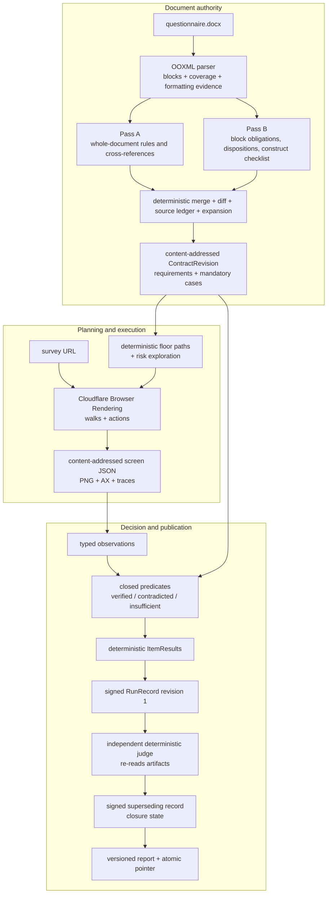

# Survey QA v2 — system overview

This is the repository orientation for a reader who wants to understand how the current v2 system
works before changing or operating it. It describes the implementation, not an aspirational
single-agent browser demo. When a dated status document and source disagree, inspect the current
source and run fresh tests; dated deployment records remain useful evidence but are not live state.

## 1. Goal and non-negotiable rules

The end goal is a fully operational service that can accept an unfamiliar questionnaire and an
unfamiliar survey URL, exercise the survey as a respondent would, compare the observed behavior with
the document, and produce a truthful, reproducible report with explicit coverage and limitations.

The North Star in [AGENTS.md](../AGENTS.md) makes “unfamiliar” load-bearing:

- no example questionnaire, generated fixture, vendor DOM, or question-id convention defines the
  core architecture;
- platform knowledge belongs in a declared adapter, never as an invisible core rule;
- every assumption must be stated, detected where possible, and degrade to a named limitation;
- the questionnaire is authoritative; a site/document disagreement is a site defect;
- genuine document ambiguity is a question for a reviewer, not permission to guess;
- unread content and unperformed work stay visible and counted;
- coverage is computed over a fixed denominator, not asserted by the component being measured;
- a new gate needs a negative fixture, mutation, or other evidence that it can fail.

Failures drive permanent capability improvements. A fix is complete only when it names the general
violated invariant, changes the shared abstraction rather than one survey, preserves a minimized
platform-neutral reproducer, proves the gate can fail, checks adjacent counterexamples, and passes
the integrated path. Unsupported classes remain named, counted, and unactuated. Limited live-link
access is used to discover the next unknown class only after known classes have been closed locally;
durable before/action/after captures make that evidence reusable without repeatedly spending access.

Two measured traps explain the strictness. The graph prototype worked partly because its corpus was
forward-only, one-question-per-screen, statically identifiable, and free to replay. A deterministic
DOCX parser scored perfectly on documents generated from the same manifests it effectively inverted.
Neither result proves behavior on a new survey. See [graph-spike/FINDINGS.md](../graph-spike/FINDINGS.md)
and [the document-processing playbook](document-processing-playbook.md).

## 2. What happens when someone submits the link

The v2 host is behind Cloudflare Access. The landing page submits a multipart form containing a
`.docx`, a survey URL, and server-supported run options to `POST /api/v2/runs`. JSON plus base64 is
also accepted by the API. The handler:

1. validates request, document, locale, viewport, URL, and size boundaries;
2. rejects embedded URL credentials and, by default, obvious loopback/private targets;
3. hashes and stores the document under the v2 namespace;
4. creates a `v2r_…` run envelope and one atomic initial checkpoint;
5. creates a Cloudflare Workflow instance whose instance id is the run id; and
6. returns `202 Accepted` with `Location: /runs/<run-id>`.

The browser-visible `/runs/<run-id>` page is a watcher, not the workflow. It reads durable
projections:

- `/api/v2/runs/<run-id>/status` — phases, liveness, completion, and progress revision;
- `/api/v2/runs/<run-id>/coverage` — sealed denominators, seven coverage buckets, current attempt,
  usage, and caps;
- `/api/v2/runs/<run-id>/execution-activity` — committed walk attempts, screen changes,
  deduplicated stable-screen counts, origin-only visited sites, and recorded limitations; this is
  explicitly an activity feed, not QA coverage;
- `/api/v2/runs/<run-id>/report` — `202` while building, or a clearly labelled partial/final
  artifact once published;
- `/api/v2/runs/<run-id>/record` — the integrity-checked canonical RunRecord;
- `/api/v2/runs/<run-id>/evidence` — the run's evidence catalogue; and
- `/api/v2/runs/<run-id>/visual-status` — the isolated post-run visual-shadow channel.

The asynchronous split matters. A model call or browser walk is not held inside the submission HTTP
request, and refreshing the watcher cannot duplicate the run. Status is projected from the durable
checkpoint; the frontend does not infer progress from a spinner or phase order.

## 3. Architecture and trust boundaries



The separation is intentional:

- extraction models may propose what the document obliges, but approval gates and the immutable
  seal define what later stages may use;
- the browser records what it saw and did, but no browser artifact has a verdict field;
- closed code compares typed expectations with re-read evidence;
- the run's own deterministic aggregation is signed, then a separate judge independently re-derives
  results and binds them to the signed record, contract, target identity, and evidence manifest;
- only a usable, attested judgement may drive “current results” in the report.

## 4. Document ingestion: from DOCX bytes to source blocks

A DOCX is an OOXML ZIP archive, not a plain text file. `worker-v2/src/extract/docx-blocks.ts` reads
the accepted document view into addressable `SourceBlock` records. A block has a stable parse-order
id, kind, exact text, origin, section, table coordinates when known, and neutral formatting
evidence. Current block kinds are paragraph, heading, list item, table cell, and footnote; origins
also identify endnotes, headers/footers, comments, image alternative text, and lifted OOXML
constructs where supported.

The parser reports `DocumentCoverage` alongside the blocks:

- archive parts found, read, and skipped with reasons;
- images and how many had alternative text;
- unresolved field codes, symbol runs, and auto-numbered paragraphs; and
- plain-language problems that must travel into extraction and reporting.

This is the “fail loudly, never silently short” boundary. Missing footnotes do not produce a
shorter-looking questionnaire; they produce skipped-part counts. Word auto-numbering that cannot be
rendered becomes an explicit placeholder/problem. Unbalanced or pathological markup is refused
rather than scanned without bound.

### Formatting and grey programming instructions

Formatting is retained first as evidence: per-run highlight/shading/style values plus paragraph and
cell backgrounds. Semantic interpretation is separate. The default
`none/1.0.0` profile is neutral: grey remains ordinary retained text plus named formatting evidence.
The optional `shop-direct-grey-programming/1.0.0` profile can classify directly proven achromatic
grey runs as programming logic while a colored highlight counterweights a grey ancestor.

That profile is **not a universal Word rule**. It is named in the parser version and coverage output
because one shop uses grey this way, while others do not. Theme/style-derived backgrounds that cannot
be resolved remain named limitations. Non-grey programming instructions are still retained for Pass A
and Pass B; grey is supplemental provenance, not the sole instruction detector. The general
architecture is: preserve formatting evidence for every document; apply semantics only through an
explicit document-semantics profile; never silently delete grey text or let it become an answer
option merely because of a corpus convention. Relationship and auxiliary-source formatting repairs
are under final release-blocking audit, so this is not yet a deployed W6 claim.

## 5. Pass A, pass B, windows, chunks, and waves

The word “pass” is overloaded in ordinary English. **Extraction Pass A and Pass B are reading
methods, not success verdicts.** Neither means that a survey passed QA.

### Pass A: cross-cutting document read

Normal Pass A uses exact `grok-4.5`. It reads the entire questionnaire for survey-wide rules and
cross-references: requirements such as “every question must…”, exceptions, global routing
conventions, and other statements a question-by-question reader is structurally likely to miss.
Pass A emits raw requirements, ambiguities, browser-unverifiable mandates, and resolved/unresolved
cross-references. It does **not** pretend to disposition every block.

If the annotated document is too large for one request, Pass A splits it on block boundaries into
ordered **windows**. Windows are processed serially because they are large, their order is part of
provenance, and concurrent large prompts amplify isolate memory and retry cost.

### Pass B: block accountability read

Normal Pass B uses DeepSeek Pro. It walks ordered **chunks** of source blocks. A chunk is
bounded by configurable character and block ceilings, never splits a block, and keeps a table row
together when possible. Configured global-instruction blocks may be supplied as context; they do not
become a second denominator.

Every chunk owes:

- candidate obligations/requirements;
- a disposition for every block id it received;
- a verdict for every declared construct class; and
- ambiguities and browser-unverifiable mandates.

A missing block disposition is stored as `unresolved`; a failed chunk is a failed unit carrying its
block ids and attempt count. Once every chunk has landed, a bounded ledger sweep revisits normative
or unresolved blocks that no requirement accounts for. The sweep can improve the read, but it cannot
reclassify gaps in code merely to make the gate green.

### What a wave means

A **wave** is one time-bounded Cloudflare Workflow step that works on the remaining Pass A windows
or Pass B chunks/sweep units. It is not a new document interpretation, a model vote, a browser path,
or a replacement denominator.

Within a wave the extractor:

1. re-reads already persisted unit artifacts for free;
2. issues new calls only while the wave's issue budget remains;
3. always issues at least one owed unit so a zero/small budget cannot livelock;
4. lets an already-issued call finish; and
5. persists that unit before moving on.

The step timeout is derived as `wave issue budget + one complete purchase ceiling + slack`. A
“purchase” includes the transport's configured internal attempts. This prevents a Workflow timeout
from killing a paid response before it is persisted and then buying it again. Unit issue counts live
in their artifacts, so waves, Workflow retries, and recovery instances share one bounded retry
allowance. Exhausting the maximum wave count stops extraction with the exact remaining-unit count;
it never seals a half-read document.

The only Pass-A fallback is a retained eligible typed Grok failure (for example bounded provider
unavailability, timeout/network, quota exhaustion, or invalid/empty returned content under the exact
model identity). It substitutes DeepSeek Flash for Pass A while DeepSeek Pro remains Pass B. A
Flash+Pro result is deliberately marked reduced same-provider independence and cannot pose as normal
cross-provider corroboration. The paid-call prerequisite is the exact 16-field
`survey-qa-grok-rate-binding/1.0.0` binding for `grok-4.5`: source `owner-console-confirmation`, policy
`max-known-text-tier/1.0.0`, observed 15 August 2026, canonical SHA-256
`9bc864b4e87925b6bc7d4426e3a074d6f5b7e5c8b582e1e91e0b257a2618289e`, 500K context, and a 200K
long-context threshold. Input/cached-input/output rates are $2/$0.30/$6 per Mtok at or below 200K
and $4/$0.60/$12 above 200K; the max-known reservation is $4/$12 per Mtok. A future authenticated
exact-model catalogue receipt is an independent cross-check only, not the provenance of this
owner-console-confirmation binding or a release prerequisite. No 4.6 rate is reused.

In short:

| Term | Meaning |
|---|---|
| block | One addressable piece of document source and provenance |
| Pass A window | A large ordered group of blocks for the cross-cutting read |
| Pass B chunk | A smaller accountable group of blocks for per-block reading |
| sweep unit | A bounded re-read of still-unaccounted Pass B blocks |
| wave | One durable time slice over whatever units remain |
| model attempt | One provider HTTP attempt inside a purchased unit call |
| unit issue | One bounded purchase of a window/chunk/sweep across the whole run |
| Workflow retry | Platform retry of the step; persisted units are reclaimed, not repurchased |

## 6. Obligations, requirements, dispositions, and constructs

These terms describe different layers.

### Obligation / requirement

An **obligation** is a proposition the document says the survey should satisfy. Pass B calls its raw
candidate rows `obligations`; the shared extraction type calls candidates `RawRequirement`. After
normalization and merge, a `ScopedRequirement` is the sealed document row with stable lineage/version
identity, scope, quantifier, selector, exceptions, facet, assertion status, testability, source atoms,
normative statement, and exact display quote. The planner adapts each sealed requirement back into
its `PlannerObligation` vocabulary using the requirement lineage id.

The vocabulary change does not change authority: the sealed requirement is the denominator row.

### Block disposition

A **block disposition** answers “what role did this piece of source play in extraction?” It is not a
survey verdict. The closed values are:

- `normative` — asserts something binding and must be cited/accounted;
- `mapped-context` — relevant context attached to mapped requirements;
- `non-normative` — read and deliberately excluded from obligations;
- `ambiguous` — the source admits competing readings; and
- `unresolved` — the extractor did not establish a safe disposition.

The source ledger reconciles every source block against dispositions and citations. “Normative but
uncited” and “unresolved” stay visible. Tables have explicit row-accounting rules; lifted content such
as a suggestion hosted in a cell is not silently absorbed behind a cited sibling.

### Construct checklist

Pass B must disposition all eleven construct classes whether present or absent: question,
option-list, skip-rule, terminate, validation, piping, carry-forward, calculation, randomization,
loop, and instruction. An omitted class keeps the approval gate open. This prevents “the model said
nothing about loops” from being misreported as “there are no loops”.

### Assertion status and browser observability

A sealed requirement records whether its assertion is entailed, explicit-negative, document-silent,
ambiguous, or disputed. Only entailed and explicit-negative rows constrain matching. Ambiguous and
disputed rows remain visible but are withheld from pass/fail rather than resolved by confidence.
Requirements also state whether they are browser-observable; non-observable mandates remain report
rows, not invented browser tests.

## 7. Merge, source ledger, expansion, and sealing

The deterministic merge performs four jobs:

1. normalize both passes into stable identities;
2. match compatible readings while retaining which pass found each one;
3. surface misses and disputes in an extraction diff rather than hiding them behind a union; and
4. build the source ledger and typed expansion preview.

A row found by one pass is not discarded merely because the other missed it, but it is labelled as a
one-pass finding. Mutually incompatible route destinations become a high-risk dispute that code
cannot choose on a human's behalf.

### Expansion: requirements are not execution cases

The deterministic floor expander turns a requirement into the cases the document itself enumerates.
A routing requirement with several stated answers can produce several route cases; an option-set
requirement can produce a membership case; a boundary requirement can produce typed inputs. The
expander never uses options discovered on the live site to fill a document gap, because that would
make the denominator depend on the system being tested.

If the document enumerates a case but the current predicate taxonomy cannot decide it, the case
still enters the denominator with a closed `expectationGap` code. A limitation does not make the
case disappear.

### The four extraction approval gates

The model-extracted contract may seal only when all four gates pass with evaluator/version/input-hash
proof:

1. `zeroUnexplainedNormativeBlocks`;
2. `noUnresolvedHighRiskDisagreement`;
3. `allConstructClassesDispositioned`; and
4. `allScopedExpansionsPreviewed`.

`not-evaluated` is a separate type with no success boolean. This is deliberate: a stage that never
ran cannot return zero problems and accidentally certify itself.

The resulting `ContractRevision` is content-addressed and immutable. Its semantic content determines
its id; later stages read it by id and re-hash it. A run cannot regenerate or silently amend its own
denominator.

There is also an explicitly human-authored contract path with its own validation gates and a sealed
limitation: it validates authored rows and exact source binding, but does not independently rediscover
omissions. It never pretends the two model passes ran.

## 8. Denominators: the numbers that must stay separate

The system carries at least two load-bearing denominators:

1. **document requirements** — the sealed parent rows a reviewer reads; and
2. **mandatory execution cases** — the typed cases the browser/verifier must settle.

They are reported together but never added. One requirement can have zero, one, or several cases.
Rows that are ambiguous, disputed, or not browser-observable remain in the requirement denominator
even when they produce no pass/fail case.

Execution coverage has exactly seven buckets:

`exercised`, `not-reached`, `proven-unreachable`, `blocked`, `budget-exhausted`, `time-exhausted`,
and `pending`.

After sealing, these buckets must contain non-negative safe integers and sum exactly to the mandatory
case total at every checkpoint write. That reconciliation proves accounting consistency; it does not
prove the extracted requirement set was complete or correct. Extraction accuracy and execution
coverage are separate measurements.

## 9. Deterministic planning: cases, paths, and exploration

Planning is a pure function of the sealed contract: no model calls, site reads, or browser evidence.
It builds:

- a **floor** path set intended to witness every obligation;
- an assignment from mandatory cases to the paths intended to exercise them; and
- a risk-ranked exploration queue.

A **path** is a planned survey route. A **walk** is one browser execution of a path. A **case** is one
row of the fixed execution denominator. Completing a walk does not automatically prove every case
assigned to its path; evidence must show the case's stimulus and target were actually exercised.

Exploration may add defect evidence. It has no authority to mint cases or move the denominator.
Unassigned cases and unsupported planned capabilities are emitted as counted limitations.

Multi-path decision seeding has received an **A-G GO** for its declared capability and closes the
four integrity blockers recorded in
[the walker integration review](CODEX-WALKER-INTEGRATION-REVIEW-11AUG.md). Authority comes only from
sealed, positively entailed singleton options; ambiguous, disputed, document-silent, duplicate, or
unsupported candidates are withheld and counted. `SeedPlan` preserves the theoretical candidate,
materialized, omitted, selected, dropped, and residual census under explicit budgets, and execution
program 2.1 is bound to a checkpointed whole-program hash and regenerated from the sealed revision on
load.

Each selected alternative carries semantic occurrence and prior-history identity. Before a browser
effect, execution checkpoints a reservation; afterward it writes an immutable attempt artifact and
uses one fenced checkpoint mutation to bind the exact walk, certificate, action/readback, before/after
screen evidence, and first per-case witness receipt. Resume re-hashes and re-derives those artifacts,
rebuilds mutable progress from checkpoint authority, and projects certificate/receipt pointers into
the signed record. A walk without that exact receipt earns no seeded-case credit.

The boundary remains deliberately conservative: pairwise/multiselect seeds, prior free text, prior
actions without an exact retained-state contract, and navigator-default history are named withheld
classes; budget omissions remain in the census; and a reservation whose immutable artifact is missing
is retired as lost work with no retry and no coverage. These are capability limits, not silent proof.

## 10. Browser execution and evidence

The executor uses Cloudflare Browser Rendering with Puppeteer-compatible page primitives. A batch
reconnects to a durable browser session, executes bounded walks, writes progress after each path, and
disconnects without necessarily closing the session. A cold browser acquisition has one bounded
transient retry; repeated acquisition failure becomes `browser-unavailable`, not an infinite storm.

For each relevant screen epoch the driver can retain:

- the complete rendered screen JSON inventory;
- a viewport PNG screenshot;
- Chrome's accessibility tree;
- capture geometry, scope, timestamps, content hashes, and pairing metadata;
- before-action, after-action, and after-advance screens;
- exact action receipts and selected values/codes;
- validation messages, page errors, navigation controls, and progress indicators; and
- every capture failure or reader limitation with a count.

Screen JSON, screenshot, and accessibility capture are sequential protocol operations, so the epoch
records the capture window rather than pretending they were atomic. Evidence bytes are
content-addressed; per-run catalogue entries bind ids to hashes. Consumers re-hash bytes before use.

### What the live activity panel means

The run watcher keeps browser activity separate from the coverage ledger because the numbers have
different grains:

- a **walk attempt** is one durable browser drive or retry recorded in execution progress;
- a **screen change** is one retained step where the stable screen identity changed after advancing;
- a **unique stable screen** is a deduplicated identity from verified walk-artifact bytes; and
- a **coverage-credited walk** is a walk that closed at least one sealed mandatory case.

Therefore 44 screen changes can legitimately be repeated movement between two stable screens, and
both numbers can coexist with zero credited cases. A return to a previously seen stable screen is
counted separately as a loop signal. The watch page labels this block **browser activity — not QA
coverage** and does not place the values in one progress meter.

The feed is partial-progress evidence, but it is durable rather than speculative. Execution progress
is written after a walk ends, so the currently in-flight walk remains visible through the separate
`currentAttempt` status field and appears in activity only after its ledger row is committed. The
ledger totals cover every committed walk. New walk rows carry the exact content-addressed
`PathObservation` evidence id, so the watcher can re-read and re-hash that walk immediately; it
does not wait for the post-execution walk index. The immutable index remains the compatibility
binding for legacy rows that lack the direct id. Artifact-derived unique-screen/origin/error counts
inspect only a bounded tail (currently 24 walk artifacts); the response reports the inspected,
unresolved, unreadable, and limit-omitted denominators and marks derived counts exact or
lower-bound. Missing capture fields mean **unknown**, not zero. An inconsistent execution total,
direct binding, or index fails closed instead of producing a plausible-looking page count.

This is also a privacy projection. It may return HTTP(S) origins such as
`https://survey.example`, but never URL credentials, path, query, fragment, page title/text, option
or action labels, raw screen signatures, raw errors, or W5 witness-receipt content. Screen signatures
are used in memory only to deduplicate counts.

### Identity and action rules

The driver does not assume a question id appears in a heading or DOM id. It combines document wording
and independently observed markup signals, refuses ambiguous bindings, and records every refused
decision. Wording mismatch caused by paraphrase, translation, or split screens costs coverage; it
does not authorize selecting an answer on the wrong screen.

The current driver handles radio/checkbox choices, grid cells, constrained text/value inputs,
constant-sum allocations, navigation controls, and native single-select controls with full scoped
option identity and retained post-action readback. It refuses a screen with disjoint visible
question owners and only treats a uniquely evidenced forward action as advance. Navigator defaults
are recorded as defaults and never mistaken for a document-requested stimulus. Custom widgets,
native multi-select, and drag-and-drop remain named unsupported limits; password/file inputs,
unknown/rejected values, and disabled controls become `UnfillableControl` records.

Custom combobox/listbox widgets and drag/sort/drop semantics are inventoried but not certified for
generic actuation. Native multi-select is also not certified by the current slice. These produce
`unsupported-widget`, `selection-ambiguous`, or another named unfillable reason rather than a guessed
gesture. Back-navigation probes and independent-session repeats are likewise excluded from executable
work and can block test completion when mandatory.

The supported submission viewport is currently exactly one 1280×900 desktop viewport. The API
rejects mobile/multiple viewport claims because accepting them while using only the first would be
false coverage.

## 11. Visual perception and computer use

These are two different capabilities.

### Visual perception

The visual path gives a vision model only the screenshot and a generic inventory schema. It does not
give the model document requirements or a proposed verdict. Chrome accessibility supplies semantic
roles/states, and DOM supplies actuation/hit-test facts. Deterministic reconciliation preserves
agreement, visual-only, semantic-only, conflict, ambiguity, and uncovered scope without silently
letting one channel repair another.

The infrastructure is currently **shadow-only and disabled** (`VISUAL_SHADOW_ENABLED=false`). A
separate post-core Workflow and `/visual-status` endpoint exist so visual experiments cannot mutate
the core checkpoint, signed records, judgement, or report. The previous Gemma/Gemini/Mistral bake-off
produced provider artifacts and evaluation machinery, but no provider satisfied the release boundary
well enough to be approved as the production source of visual facts. “No winner” means exactly that;
it does not mean every model failed to return JSON or see pixels.

Paid visual rollout remains blocked on a shared durable reservation/settlement authority, a settled
provider under preregistered public-fixture gates, and deterministic predicates that can consume the
reconciled facts. See [worker-v2/VISUAL-PERCEPTION.md](../worker-v2/VISUAL-PERCEPTION.md) and
[the vision evaluation record](vision-model-evaluation-2026-08-09.md).

### OpenAI computer use

`worker-v2/src/browser/openai-computer-use.ts` is an explicit protocol adapter for
`gpt-5.6-luna` and `gpt-5.6-terra`. Its local/mock contract suite is **GO (21/21)**. It supports
bounded screenshot, click, drag, key, type, scroll, and wait actions, with exact-origin checks, a
caller-supplied safety gate, prompt-injection warning, action/screenshot receipts, token/tool cost
accounting, and hard turn/action/time/coordinate/text
limits.

It is deliberately **not wired into the production walker or verifier**, making production a
**NO-GO** despite the local/mock result. Construction requires a
credential and fetch implementation; the credential destination is fixed to the exact official
OpenAI Responses endpoint. Running requires exact allowed page origins, pricing including the
computer-tool charge, and an application cost cap. The adapter cannot author verdicts. Before it can
become a fallback, it needs a harness that maps its actions onto the same browser session and converts
receipts into evidence without weakening the existing deterministic verification boundary. No API key
or account funding is required merely to keep or locally unit-test this adapter; a real paid test must
be explicitly provisioned first.

The 13 August Luna/Terra adversarial review kept this boundary closed. The current adapter can
pre-authorize several returned actions against one initial state, so a later action could execute on a
different screen without fresh approval; it also still needs bounded response/history payloads, exact
response-model identity, deterministic screenshot/epoch binding, and a fail-closed endpoint policy.
Accordingly, Luna and Terra are approved only for local/mock protocol evaluation. Any future production
fallback must request and authorize one action at a time after a fresh capture, remain subordinate to
the deterministic target/answer policy, and earn no QA verdict or coverage credit by itself.

## 12. Observations and tri-state verification

A browser walk is stored as path evidence. Observation projection maps that evidence onto sealed
facet instances. An `Observation` carries a typed payload, evidence ids, scoped completeness, and a
verifier record—but never a `verdict` field.

Verification re-reads the sealed expectation and bound artifact bytes. Its closed decision vocabulary
is:

- `verified` — a registered predicate established the expected behavior;
- `contradicted` — a registered predicate established the opposite; and
- `insufficient` — identity, action, evidence, scope, or predicate capability was not strong enough.

The current registered deterministic predicates cover route, boundary, and option-set cases.
Rendered-state/copy/configuration and other case kinds without a predicate stay insufficient. The
Workers AI/model-verifier availability flag does not change this: the model verifier is explicitly
unwired, and verifier provenance says so.

Negative claims require a complete scoped inventory. Missing evidence, a partial screenshot scope,
an unbound action, or an unknown predicate kind cannot prove absence. Structural checks may demote a
decision to insufficient; they cannot invent a pass or failure.

## 13. Aggregation, signed records, independent judgement, and report

The deterministic aggregator maps case decisions onto each requirement. A contradicted case produces
a failure; a mix of pass and fail produces `mixed`; all decided pass produces `pass`; ambiguity is
withheld; otherwise the row remains incomplete. Later successes never erase a failure.

The assembler builds a `RunRecord` from the sealed revision, observations, evidence catalogue, walk
ledger, ambiguities, taxonomy gaps, blockers, and usage. It rejects model-authored verdict provenance
and refuses to sign a record that hides known failures. The record is stored both at a current pointer
and under its immutable content hash.

The independent judge then:

1. reads signed record revision 1;
2. re-resolves the sealed contract;
3. loads and re-hashes every cited artifact;
4. recomputes verdicts in the deterministic judge engine;
5. binds its JudgementRecord to record payload hash, contract, target identity, checklist, and
   evidence manifest; and
6. signs with a judgement key that the deployed configuration must pin independently.

The Workflow finally signs a superseding RunRecord revision that names revision 1 and records closure
and judgement outcomes. Revision 1 cannot contain its own judgement because the judgement binds to
revision 1's hash; superseding instead of mutating preserves that chain.

Reports are built into immutable versioned HTML/data objects and published by one atomic pointer
write. A build crash cannot expose half-new HTML with half-old JSON. A report may honestly complete
for a partial or failed test; only an attested current judgement plus a complete test makes a report
final.

## 14. “Complete” is not “pass”

This distinction is central:

| Claim | Meaning |
|---|---|
| phase complete | One Workflow phase durably finished its own work |
| report complete | A report artifact was built and atomically published, including for a partial run |
| case pass | Evidence verified one typed mandatory case |
| requirement pass | All decided mandatory facets for that requirement satisfy the aggregation policy |
| test complete | Every mandatory case is terminally decided as pass, fail, or proven-unreachable, and closure blockers are absent |
| survey “ready” | A product-level conclusion that additionally depends on failures, withheld rows, extraction quality, blockers, and policy; it is not synonymous with workflow completion |

A complete test can contain failures. A report can be complete while testing is partial. A set of
passing exercised cases can coexist with many pending/not-reached cases. Untested is never pass.

## 15. Durability, recovery, reuse, budgets, and retries

### Durable state

The envelope holds run identity/recovery; the checkpoint holds atomic progress; the heartbeat holds
liveness. They are separate because a fresh heartbeat does not prove durable progress. Every
Workflow instance claims an ownership fence; a superseded recovery instance may not keep writing.

Extraction windows/chunks/sweeps, plans, path progress, evidence, observations, records, judgements,
and report versions land separately. Execution writes after every path, so a crash costs at most the
current walk rather than the whole batch. Recovery adopts an already sealed contract and plan when
their identities verify.

An exact contract-reuse index may reuse extraction only when document bytes and every load-bearing
parser/prompt/model/merge/expander input identity match. The index is a pointer, never authority; the
stored contract is re-read and re-hashed before adoption.

### Budgets

The server, not the browser form, decides the effective run policy. Named caps include maximum USD,
model calls, tool calls, and wall clock, plus verification/report dollar reserves. Extraction has its
own fraction of the run allowance. Browser batch count/time, steps per path, model unit issues, model
transport attempts, and extraction waves are also bounded independently.

These limits are not averaged into one “budget score”. A cap moves owed cases into the appropriate
terminal coverage bucket and the report says which cap fired. Extraction budget exhaustion before
sealing is stricter: no half-read contract is sealed merely to generate a partial browser report.

Failed paid calls still carry usage. Reused persisted model units carry zero new cost while retaining
original provenance. Visual spending has a separate post-run ledger and remains disabled until its
reservation/settlement rules meet the same standard.

### Partial outcomes and recovery

Budget, time, site blocking, browser unavailability, unsupported mandatory probes, and internal
coverage shortfall are different stop reasons. A partial test falls through to reporting. Unexpected
Workflow failure is recorded if resources permit, and the read path can synthesize a clearly marked
engine-terminal correction when the engine died before any final write. It never fabricates a
successful stage result.

## 16. Current capability boundary

This table is a workspace capability statement, not a promise that every survey is supported. The
deployed build may lag the worktree; inspect deployment records to identify the exact source and
configuration behind a live run.

| Area | Current capability | Named limit / next closure |
|---|---|---|
| DOCX | Accepted-view OOXML blocks, tables, notes, headers/footers, comments, alt text, formatting evidence, and coverage accounting | Auto-numbering semantics, unresolved styles/themes, and some OOXML constructs remain reported gaps; neutral default semantics and the shop-grey profile are under final release-blocking audit |
| Extraction | Normal exact `grok-4.5` global pass plus DeepSeek Pro block pass, the reviewed exact 16-field owner-console-confirmation Grok rate binding, persisted/resumable units, merge/diff/ledger/expansion, and a fail-closed seal | A qualifying typed Grok failure can use Flash for Pass A only; Flash+Pro has reduced same-provider independence and cannot seal as normal corroboration. An authenticated exact-model catalogue receipt remains a future independent cross-check, not a release prerequisite |
| Planning | Deterministic floor plus bounded exploration; denominator locked to the seal; multi-path seeding has A-G GO for its declared capability | Pairwise/multiselect and other unsupported seed classes remain named/withheld |
| Browser | Real Browser Rendering, screen/PNG/accessibility capture, scoped actions, value setting, radio/checkbox/grid/allocation, and full-identity native single-select support | Desktop only; custom widgets, native multi-select, drag/drop, back navigation, and independent repeats are not certified |
| Verification | Deterministic tri-state route, boundary, and option-set predicates | Other case kinds remain insufficient; the model verifier is unwired |
| Visual | Typed capture, provider adapters, grounding/reconciliation, and an isolated shadow workflow/status | Disabled; no provider is approved; no current-result predicate exists; durable paid reservation closure is outstanding |
| Computer use | Bounded OpenAI Responses computer-tool protocol adapter with receipts and safety gates; local/mock GO (21/21) | Production NO-GO because it remains unintegrated: no production harness, credential/budget wiring, or verdict authority |
| Records/report | Content-addressed evidence/contracts/record revisions, signatures, independent judgement, and atomic report publication | Target identity derived from captured screens is stable within a run, but is not a stable vendor build identifier across runs |

No row above means "works for every survey." A newly observed platform or interaction must either
work through a declared generic capability or become a counted, named limitation. Platform-shaped
logic belongs in an adapter whose assumption is explicit and detectable.

## 17. v1/v2 isolation

Do not touch v1 during v2 work. It is a separate live subsystem, not a fallback environment.

- The v2 Worker is `survey-qa-v2`; its public hostname is
  `https://survey-qa-v2.wellshit.co.in` and it is protected by Cloudflare Access.
- v2 run ids begin with `v2r_`, and every v2 object key is minted under `v2/`.
- v2 bindings, Workflow names, secrets, routes, and deployment/rollback history must remain separate
  from v1.
- `src/`, `runner/`, and the root `wrangler.jsonc` belong to v1. Do not deploy, edit, or inspect the
  v1 live URL as part of a v2 test.

The repository split is still a plan, not authority to move files. Read
[V2-MIGRATION-PLAN.md](V2-MIGRATION-PLAN.md) before proposing structural work.

## 18. How to verify, inspect, deploy, and roll back

Operational commands are intentionally linked to their maintained source rather than duplicated
here. Confirm the source/configuration/document tuple first; a command copied from an old handoff may
describe a different deployment.

### Local code verification

Install the repository dependencies, then run the v2 checks from `worker-v2/`:

```bash
npm install
cd worker-v2
npm run typecheck
node tools/test.mjs
```

Treat the reported denominator and exit code as evidence. Do not cite a historical test count. The
test harness contains negative fixtures and mutation checks so that critical gates demonstrate that
they can fail.

### Local UI and runtime inspection

Follow [worker-v2/PREVIEW.md](../worker-v2/PREVIEW.md) for the checked-in local preview path. That
document also records the difference between a UI preview and a real Workflow/Browser Rendering run.

### Live run inspection

[worker-v2/DEPLOY.md](../worker-v2/DEPLOY.md) is the command-level runbook for authentication,
configuration, deployment, run submission, status, object inspection, and rollback. Its run-summary
and invariant-check tools are `worker-v2/tools/runsum.mjs` and `worker-v2/tools/runcheck.mjs`.
Use both: a readable summary is not a substitute for invariant checks.

For the currently recorded live baseline and routes, read
[worker-v2/DEPLOYED.md](../worker-v2/DEPLOYED.md). For the freeze, provenance, dual-Workflow, and
rollback preconditions of a canary, read
[CANARY-DEPLOYMENT-INTEGRITY-11AUG.md](CANARY-DEPLOYMENT-INTEGRITY-11AUG.md).

### Deployment and rollback

Deployments are serial. Before any v2 deploy, freeze and record the exact source, configuration,
document bytes, target URL, and policy. Verify the deployment identity after upload, run the named
canary, wait for both relevant Workflows to become terminal, retain the run/evidence artifacts, and
only then decide whether to promote or roll back. Rollback selects a known prior v2 deployment; it
must not route v2 traffic to v1 or reuse v1 state.

The dated handoff files are historical evidence, not evergreen commands. Preserve
[HANDOFF-12AUG-SESSION.md](HANDOFF-12AUG-SESSION.md), but prefer the maintained deployment runbook for
the next action.

## 19. Glossary

| Term | Meaning |
|---|---|
| source block | One ordered, addressable unit emitted from DOCX structure, with text, provenance, and formatting evidence |
| window | Pass A's bounded whole-document slice; windows overlap to preserve cross-boundary context |
| chunk | Pass B's bounded group of source blocks sent for detailed inventory and block dispositions |
| wave | A time-sliced Workflow invocation that advances a bounded number of persisted windows/chunks/sweeps |
| obligation | A small extraction work item: a requirement, ambiguity, construct, or coverage disposition tied to evidence |
| requirement | A document-derived expectation that may expand into one or more testable facet instances |
| disposition | Pass B's explicit accounting for a source block: extracted, duplicate, non-requirement, ambiguous, or unreadable/unresolved as defined by the contract schema |
| construct | A survey structure or behavior (for example routing, quotas, grids, validation, or termination) that may require expansion beyond literal prose |
| facet instance | One occurrence-scoped, testable expectation produced from a requirement; the seal fixes this denominator |
| mandatory case | A deterministic checklist item generated for a facet instance; execution coverage reconciles against these cases |
| path | A planned sequence of browser actions and expected checkpoints used to exercise one or more cases |
| walk attempt | One committed browser execution of a path or retry; activity alone does not close a case |
| screen change | A retained advancing step whose stable screen identity changed; not a unique-page count |
| stable screen | A privacy-sensitive captured-screen identity used for deduplication; the public activity API returns only its count |
| activity-only walk | A recorded walk that closed no sealed mandatory case; useful for diagnosis but credited to no QA coverage |
| screen | A typed browser capture containing URL/title/heading, controls, visible text, screenshot, and accessibility evidence |
| observation | Evidence projected onto a sealed facet instance; it contains no verdict |
| verdict | A deterministic tri-state decision on a case: verified, contradicted, or insufficient |
| adjudication | Deterministic aggregation and independent recomputation of case and requirement outcomes |
| RunRecord | Signed, content-addressed run payload containing contract/evidence/verdict and closure references |
| JudgementRecord | Independently signed recomputation bound to a specific RunRecord payload, contract, target, checklist, and evidence manifest |
| test complete | Every mandatory case is terminally decided and no closure blocker remains; failures may still exist |
| report complete | The immutable report artifact was built and atomically published; the underlying test may be partial |
| report final | Report has a current, valid judgement and satisfies the stricter finality policy |
